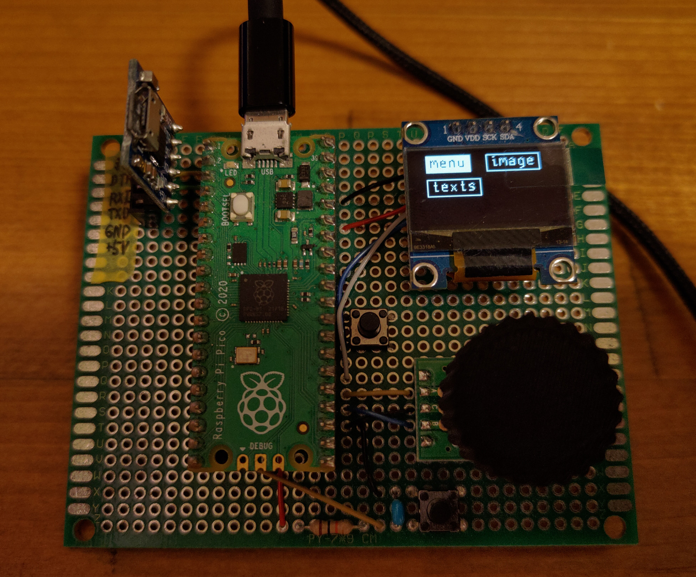

# mGUI

This program provides a basic GUI for monochrome LCD devices. Currently it only works with rp2040, but it is expected to work with other devices as well, since it is designed by extracting only the drawing part from various LCD libraries.

## Example

Open example/mgui-rp2040 in VSCode and build it with cmake. You need pico-sdk.This test board has a rp2040 with a rotary encoder, one custom button, and a reset button.

## Usage

It can be used just by including `mgui.h.`
